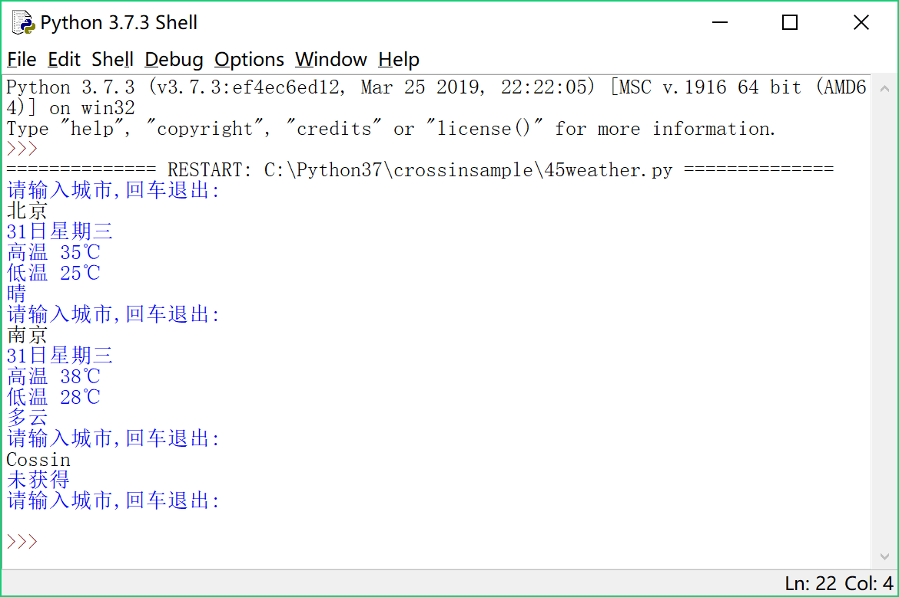
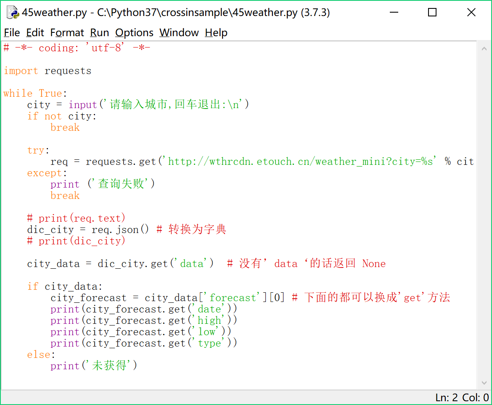

## 查天气示例代码
* weather.py 为 py 文件，可用 IDLE 或 PyCharm 打开
* weather.ipynb 也是 py 文件，需要用 jupyter notebook 打开

## 查天气文字稿

大家好，我是编程教室的目前的助教齐大圣，今天给大家看这样一个程序：



你输入一个城市的名称，这个程序就会告诉你这个城市现在的天气情况。

这个小程序实现了简单的查天气功能，算得上一个入门的“网络爬虫”，是你的代码从单机向网络进化的第一步，其中涉及到网络请求、类型转换、异常处理、模块等功能的综合应用。适合有一点基础，想开始练习网络抓取或者完成一些简单项目的同学观看。

接下来，我就说一下怎么实现这样一个小程序。

我们之所以能知道一个城市的天气，是因为用了这样一个天气查询接口：

[http://wthrcdn.etouch.cn/weather_mini?city=北京](http://wthrcdn.etouch.cn/weather_mini?city=北京)

试着在浏览器里访问一下该网址，你会自动下载一个文件，这个文件里面就是咱们想要的数据。文件用nodepad++或记事本就可以打开，打开后，里面看上去有点像python中字典类的文字是一种称作json格式的字符串。字符串包括了对应城市昨日天气及5天内的天气预报，包括气温、天气类型、风向等。

而我们的程序要做的事情，就是按照用户输入的城市名称，去这个接口请求对应的天气信息，再把结果展示给用户。

为了完成这个任务，我们要用到一个新模块：

**requests**

requests 库是一个用来获取网络资源的模块。我们平常上网，在浏览器地址栏中输入一个网址，浏览器根据这个网址拿到一些内容，然后展现在页面。类似的，requests 会跟据你提供的网址，请求对应的内容。

requests 是一个第三方库，可以通过 pip 下载安装，安装很简单，这里就不展示安装过程了。安装完毕后，我们在代码中：

**import requests**

如果没有报错，就说明安装成功了。

这里我们使用了一个新的工具: **jupyter notebook**。他允许你在浏览器环境中编写和运行代码，实现了所见即所得，非常方便。如果你刚刚开始入门，直接用 idle 或者 pycharm 运行下面这些代码，结果也是相同的。

引入requests模块后，用其中的get方法打开刚才的网址，并将结果保存在变量req中，输出req可以看到，返回了一个 Response 和一个数字，数字 200 就代表请求成功。
要查看访问到的数据，只要访问返回结果的text属性即可。

一般情况下，你会看到控制台中输出了一堆看不懂的代码文字。包括了html，css，javascript。我们在浏览器中看到的网页大部分就是由这些代码所组成。而现在，我们所请求的网页直接给我们返回了json格式的字符串，所以我们通过 req.text 拿到的就是json格式的天气数据。

json格式的字符串直接在命令行中看是没有换行和空格的一长串字符，看上去有点像字典，但它对于程序来说，仍然是字符串。我们可以直接用requests模块的json()方法，将请求得到的json格式的字符串直接转成一个真正的字典。

```python
dic_city = req.json()
print(dic_city)
```

你可能会觉得json格式的字符串和字典并没有什么区别，但字符串不能修改，也没有字典的那些方法。另外，使用type方法也可以看出它们的区别：

```python
print (type(req.text))
print (type(req.json()))
```

之后的事情就比较容易了。首先，为了能够查询不同城市的天气，我们先获取用户输入，利用字符串的格式化，拼接成要请求的 url 地址，再用requests进行请求。

```python
city = input('请输入城市:\n')
req = requests.get('http://wthrcdn.etouch.cn/weather_mini?city=%s' % city)
```

接着使用字典的get方法，去获取键 data 所对应的值。在城市名错误的情况下，会没有键
 data，get方法可以避免字典中没有’data‘这个键而导致的程序报错，get方法会返回None：

```python
city_data = dic_city.get('data')
```

接着，分别输出查询城市当天的日期、最高温、最低温和天气类型，或者进行没有找到城市时的处理：

```python
if city_data:
    city_forecast = city_data['forecast'][0]
    print(city_forecast.get('date'))
    print(city_forecast.get('high'))
    print(city_forecast.get('low'))
    print(city_forecast.get('type'))
else:
    print('未获得')
```

另外，程序使用 while 循环以便重复查询，如果没有输入任何内容，程序会自动退出，用了if判断是否存在 city。最后，为了防止在请求过程中出错，对请求过程加上了一个异常处理：

```python
while True:
    city = input('请输入城市,回车退出:\n')
    if not city:
        break
        
    try:
        req = requests.get('http://wthrcdn.etouch.cn/weather_mini?city=%s' % city)
    except:
        print ('查询失败')
        break
```

